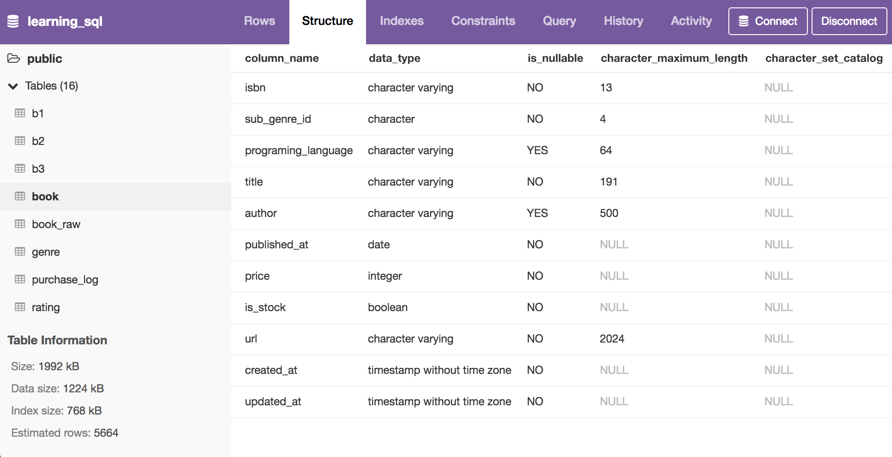

# Docker で PostgreSQL + pgweb 環境を準備する

この手順では、`docker-compose` を利用して以下の処理を行います。

1. PostgreSQL の動作するコンテナを起動する
2. 初期データベースや初期データを作成する
3. pgweb の動作するコンテナを起動する。

Webブラウザ上で動作する PostgreSQL の GUI クライアント [pgweb](https://github.com/sosedoff/pgweb) をあわせて導入します。


あらかじめ Docker 環境が準備されている必要があります。

## Docker コンテナの起動

`docker-compose` コマンドを利用してコンテナを起動します。

```bash
cd ./docker/postgres-with-pgweb
docker-compose up
```

`docker-compose` コマンドは、`docker-compose.yml` のファイルが配置されたディレクトリと同階層で実行してください。

以下の内容で PostgreSQL 環境が構築されます。

項目 | 内容
:----: | :---:
Super User:Password | root:password
DB User:Password | user1:password
DB Host | localhost
DB Port | 5432
DB Name | learning_sql

http://localhost:8081/ にアクセスすると、pgweb が利用できます。

### docker-compose の処理内容

docker-compose.yml で実行される処理は以下のとおりです。

- PostgreSQL 公式の Docker イメージ (https://hub.docker.com/_/postgres/) を利用してコンテナを作成、起動します。
    - バージョンは 10-alpine を利用します。
- データベースの初期化処理を行います。
    - 01_create_user.sql: ユーザー `user1` を作成します。
    - 02_dump.sql: データベース learning_sql およびテーブル群を作成します。テーブル内のデータも作成します。
- pgweb の Docker イメージ (https://hub.docker.com/r/sosedoff/pgweb/) を利用してコンテナを作成、起動します。
    - データベース learning_sql を接続先データベースとして指定します。

## pgweb の利用

pgweb を利用するには以下の URL にアクセスします。

- http://localhost:8081/


左側メニューにはテーブル一覧が表示されています。中央は SQL を記述し実行するための Query エディタです。

Query エディタに以下の SELECT文 を入力し、「Run Query」ボタンを実行します。macOS の場合 `Command + Enter` でも SQL を実行できます。

```sql
SELECT *
  FROM b1;
```

`b1` テーブルの内容が取得できれば成功です。


pgweb では、PostgreSQL のメタコマンド (`\dt` や `\l` など) が使用できません。そのため本書で解説しているいくつかの SQL が実行できない点にご注意ください。

メタコマンドは利用できませんが、テーブル定義やインデックス情報を GUI から確認できます。テーブル定義を確認するには、テーブル一覧から対象のテーブルを選択し、上部メニューの「Structure」を選択します。以下のようにテーブル定義が表示されます。



インデックス情報は「Indexes」、制約情報は「Constraints」メニューからそれぞれ確認できます。
